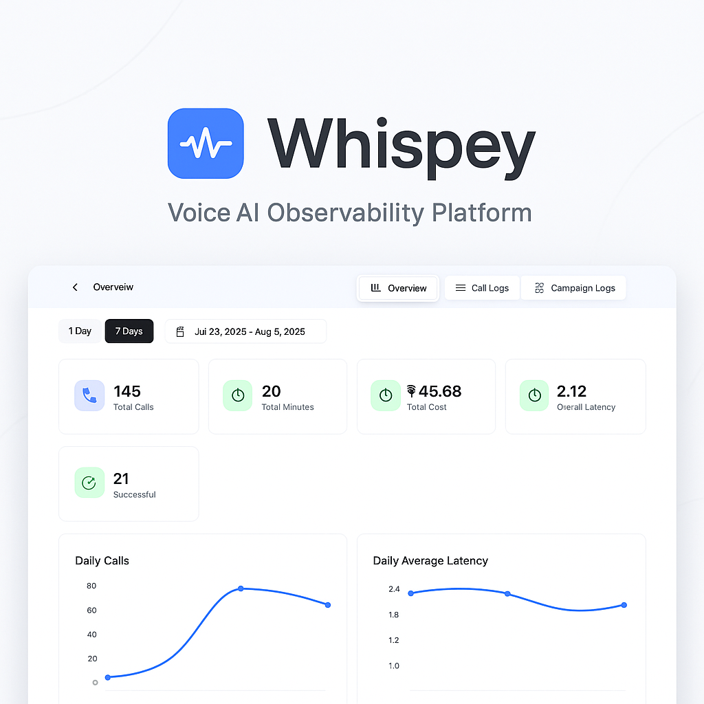

# Whispey – Voice AI Observability Platform

<div align="center">

[](https://opensource.org/licenses/MIT)
[](https://www.python.org/downloads/)
[](https://badge.fury.io/py/whispey)
[](https://pype-voice-analytics-dashboard.vercel.app/docs)
[](https://github.com/PYPE-AI-MAIN/whispey/graphs/contributors)
[](https://github.com/PYPE-AI-MAIN/whispey/stargazers)

**Professional voice analytics and observability for AI agents. Monitor, analyze, and improve your voice AI applications with beautiful dashboards and actionable insights.**


<p align="center">
  
</p>


[🚀 Get Started](#quick-start) • [📊 Live Demo](https://www.whispey.xyz/) • [📖 Documentation](https://www.whispey.xyz/docs) • [⭐ Star on GitHub](https://github.com/PYPE-AI-MAIN/whispey)

</div>

<div align="center">

</div>

## ✨ Features

- **🔍 Real-time Monitoring** - Track every voice interaction with comprehensive analytics
- **💰 Cost Tracking** - Monitor STT, TTS, and LLM costs across all providers
- **⚡ Performance Metrics** - Analyze latency, response times, and quality scores
- **🎯 Multi-Project Support** - Organize and compare multiple voice AI applications
- **📈 Beautiful Dashboards** - Intuitive visualizations with customizable views
- **🔒 Privacy-First** - Self-host option with complete data control
- **📤 Data Export** - Export analytics to CSV for further analysis
- **🔧 Easy Integration** - One-line SDK integration with LiveKit agents
- **🌐 Open Source** - Full transparency and community-driven development

## 🚀 Quick Start

### Cloud Platform (Recommended)

Get started in under 2 minutes with our hosted platform:

#### 1. Get Your Credentials

1. **Sign up** at [Whispey Voice Analytics Dashboard](https://www.whispey.xyz/)
2. **Get your Agent ID** from the dashboard
3. **Generate your API Key** from your account settings

#### 2. Environment Setup

Create a `.env` file in your project root:

```env
# Whispey Voice Analytics
WHISPEY_API_KEY=your_whispey_api_key_here
```

#### 3. Install and Integrate

```bash
# Install the SDK
pip install whispey
```

```python
from dotenv import load_dotenv
from whispey import LivekitObserve

# Load environment variables
load_dotenv()

# Initialize observability with your Agent ID
whispey = LivekitObserve(agent_id="your-agent-id-from-dashboard")

# Wrap your LiveKit session
session = AgentSession(...)
session_id = whispey.start_session(session, phone_number="+1234567890")

# Ensure data is exported on shutdown
async def whispey_shutdown():
    await whispey.export(session_id)

ctx.add_shutdown_callback(whispey_shutdown)
await session.start(...)
```

**📊 View your analytics:** [https://www.whispey.xyz/](https://www.whispey.xyz/)

### Self-Hosted Installation

For complete control over your data, deploy Whispey on your own infrastructure:

```bash
# Clone and setup
git clone https://github.com/PYPE-AI-MAIN/whispey
cd whispey
npm install

# Configure environment
cp .env.example .env.local
# Edit .env.local with your Supabase and Clerk credentials

# Run development server
npm run dev
```

**🔧 Detailed setup guide:** [Self-hosting Documentation](docs/self-hosting.md)

## 🏗️ Architecture

Whispey consists of three main components:

- **Python SDK** - Lightweight library for data collection
- **Dashboard** - Next.js web application for analytics visualization  
- **Backend** - Supabase for data storage and real-time updates

## 📊 What You Can Track

| Metric | Description | Providers |
|--------|-------------|-----------|
| **Latency** | Response times for each component | All STT/TTS/LLM providers |
| **Costs** | Token usage and billing across services | OpenAI, Anthropic, Google, Azure |
| **Quality** | Transcription accuracy, response relevance | Custom scoring algorithms |
| **Usage** | Call volume, session duration, user patterns | Built-in analytics |

## 🎯 Use Cases

- **Production Monitoring** - Keep voice AI applications running smoothly
- **Cost Optimization** - Identify expensive operations and optimize spending
- **Quality Assurance** - Review call transcripts and agent responses
- **Performance Debugging** - Diagnose latency issues and bottlenecks
- **Business Intelligence** - Generate reports for stakeholders

## 🛠️ Technology Stack

- **Frontend:** Next.js 14, React, Tailwind CSS, shadcn/ui
- **Backend:** Supabase (PostgreSQL + Real-time)
- **Authentication:** Clerk.dev
- **SDK:** Python 3.8+, asyncio
- **Analytics:** Custom metrics engine
- **Deployment:** Vercel, Docker support

## 📚 Documentation

- [🚀 Getting Started Guide](docs/getting-started.md)
- [🔧 SDK Reference](docs/sdk-reference.md)
- [🏠 Self-hosting Guide](docs/self-hosting.md)
- [📊 Dashboard Tutorial](docs/dashboard-guide.md)
- [🔌 API Documentation](docs/api-reference.md)
- [❓ FAQ](docs/faq.md)

## 🤝 Contributing

We welcome contributions from the community! Here's how to get started:

1. **Fork the repository**
2. **Create a feature branch:** `git checkout -b feature/amazing-feature`
3. **Make your changes** and add tests
4. **Run the test suite:** `npm test`
5. **Commit your changes:** `git commit -m 'Add amazing feature'`
6. **Push to the branch:** `git push origin feature/amazing-feature`
7. **Open a Pull Request**

Please read our [Contributing Guidelines](CONTRIBUTING.md) and [Code of Conduct](CODE_OF_CONDUCT.md) before contributing.

### Development Setup

```bash
# Clone the repository
git clone https://github.com/PYPE-AI-MAIN/whispey
cd whispey

# Install dependencies
npm install

# Set up environment
cp .env.example .env.local

# Start development server
npm run dev
```

### SDK Development

```bash
# Navigate to SDK directory
cd sdk

# Install Python dependencies
pip install -r requirements.txt

# Install in development mode
pip install -e .
```

## 🔒 Security

Security is a top priority for Whispey. We implement:

- **End-to-end encryption** for data in transit
- **SOC 2 compliant** infrastructure partners
- **Regular security audits** and dependency updates
- **Privacy-first design** with optional self-hosting

Found a security issue? Please email security@whispey.ai instead of opening a public issue.

## 📈 Roadmap

- [ ] Multi-language SDK support (JavaScript, Go, Rust)
- [ ] Advanced ML-powered insights and anomaly detection
- [ ] Slack/Discord integrations for alerts
- [ ] GraphQL API
- [ ] Mobile app for monitoring on-the-go
- [ ] Custom webhook integrations

<!-- See our [public roadmap](https://github.com/whispey-ai/whispey/projects/1) for more details. -->

## 💬 Community & Support

- **🐛 Bug Reports:** [GitHub Issues](https://github.com/whispey-ai/whispey/issues)
- **💡 Feature Requests:** [GitHub Discussions](https://github.com/whispey-ai/whispey/discussions)
- **💬 Chat:** [Discord Community](https://discord.gg/pypeai)
- **📧 Email:** support@whispey.ai
- **📱 Twitter:** [@WhispeyAI](https://twitter.com/WhispeyAI)

## 🏢 Enterprise

Need enterprise features like SSO, custom deployments, or dedicated support? 

**Contact us:** enterprise@whispey.ai

## 📄 License

This project is licensed under the MIT License - see the [LICENSE](LICENSE) file for details.

## 🙏 Acknowledgments


- Built with ❤️ by the [PYPE](https://pypeai.com/home) team
- Inspired by the observability tools from Datadog, New Relic, and Honeycomb
- Special thanks to the LiveKit community for their amazing real-time infrastructure

---

<div align="center">

**⭐ Star us on GitHub if Whispey helps your voice AI applications!**

[⬆ Back to top](#-whispey--voice-ai-observability-platform)

</div>
